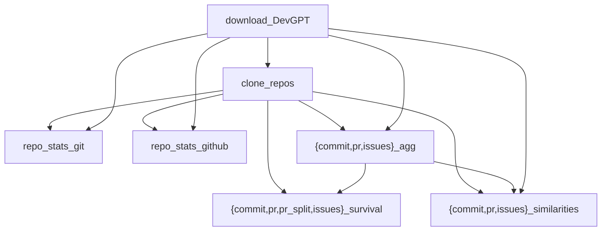

# How I Learned to Stop Worrying and Love the ChatGPT
Replication package for MSR'24 Mining Challenge

https://2024.msrconf.org/track/msr-2024-mining-challenge

## First time setup

You can set up the environment for using this project, following
the recommended practices (described in later part of this document),
by running the [`init.bash`](init.bash) Bash script, and following
its instructions.

Note that this script assumes that it is run on Linux, or Linux-like
system.  For other operating systems, you are probably better following
the steps described in this document manually.

### Virtual environment

To avoid dependency conflicts, it is strongly recommended to create
a [virtual environment][venv], for example with:
```cli
python3 -m venv venv
```

This needs to be done only once, from top directory of the project.  
For each session, you should activate the environment:
```cli
source venv/bin/activate
```
This would make command line prompt include "(venv) " as prefix,
thought it depends on the shell used.

Using virtual environment, either directly like shown above, or
by using `pipx`, might be required if you cannot install system
packages, but Python is configured in a very specific way:

> error: externally-managed-environment
>
> × This environment is externally managed

[venv]: https://python.readthedocs.io/en/stable/library/venv.html

### Installing dependencies

You can install dependencies defined in [requirements.txt][] file
with `pip` using the following command:
```cli
python -m pip install -r requirements.txt
```
Note: the above assumes that you have activated virtual environment (venv). 

[requirements.txt]: https://pip.pypa.io/en/stable/reference/requirements-file-format/


## Running with DVC

You can re-run whole computation pipeline with `dvc repro`, or at least
those parts that were made to use **[DVC][]** (Data Version Control) tool.

[DVC]: https://dvc.org/

You can also run experiments with `dvc exp run`.

**NOTE** that DVC works best in a Git repository, and is by default configured
to require it.  If you cloned this project with Git, it should work out of
the box; if you got this project from Figshare (<https://figshare.com/s/c88797dd7db323886442>)
you would need to either:
- use [DVC without Git][initializing-dvc-without-git]
  by setting `core.no_scm` config option value to true in the [DVC configuration][dvc-configuration]
  with `dvc config --local core.no_scm true`, or
- run `git init` inside unpacked directory with replication package

Currently, the [`init.bash`](init.bash) script does not handle this
issue automatically.

[initializing-dvc-without-git]: https://dvc.org/doc/command-reference/init#initializing-dvc-without-git "dvc init | Initializing DVC without Git"
[dvc-configuration]: https://dvc.org/doc/user-guide/project-structure/configuration


### Configuring local DVC cache _(optional)_

Because the initial external DevGPT dataset is quite large (it is 650 MB
as *.zip file, and 3.9 GB uncompressed into directory), you might want
to store DVC cache in some other place than your home repository.

You can do that with [`dvc cache dir`][dvc-cache-dir] command:
```cli
dvc cache dir --local /mnt/data/username/.dvc/cache
```
where you need to replace `username` with your login (on Linux you can
find it with the help of `whoami` command).

### Configuring local DVC storage

To avoid recomputing results, which takes time, you can configure
local [dvc remote storage][dvc-remote-storage], for example:

```cli
cat <<EOF >>.dvc/config.local
[core]
    remote = local
['remote "local"']
    url = /mnt/data/dvcstore
EOF
```

Then you would be able to download computed data with `dvc pull`,
and upload your results for others in the team with `dvc push`.
This assumes that you all have access to `/mnt/data/dvcstore`,
either via doing the work on the same host (perhaps remotely),
or it is network storage available for all people in the team.

[dvc-cache-dir]: https://dvc.org/doc/command-reference/cache/dir
[dvc-remote-storage]: https://dvc.org/doc/user-guide/data-management/remote-storage

### Description of DVC stages

DVC pipeline is composed of 14 stages (see [`dvc.yaml`](dvc.yaml) file).
The stages for analyzing commit data, pull request (PR) data, and issues data
have similar dependencies. The graph of dependencies shown below
(created from the output of `dvc dag --md`) is therefore
simplified for readability.



Each of the stages is described in [`dvc.yaml`](dvc.yaml) using `desc`;
you can get list of stages with their descriptions with `dvc stage list`:

| **Stage**           | **Description**                                                     |
|---------------------|---------------------------------------------------------------------|
| download_DevGPT     | Download DevGPT dataset v9 from Zenodo                              |
| clone_repos         | Clone all repositories included in DevGPT dataset                   |
| commit_agg          | Latest commit sharings to CSV + per-project aggregates              |
| pr_agg              | Latest pr (pull request) sharings to CSV + per-project aggregates   |
| issue_agg           | Latest issue sharings to CSV + per-project aggregates               |
| commit_survival     | Changes and lines survival (via blame) for latest commit sharings   |
| pr_survival         | Changes and lines survival (via blame) for latest pr sharings       |
| pr_split_survival   | Changes and lines survival (via blame) for pr sharings, all commits |
| issue_survival      | Changes and lines survival (via blame) for latest issue sharings    |
| repo_stats_git      | Repository stats from git for all cloned project repos              |
| repo_stats_github   | Repository info from GitHub for all cloned project repos            |
| commit_similarities | ChatGPT <-> commit diff similarities for commit sharings            |
| pr_similarities     | ChatGPT <-> commit diff similarities for PR sharings                |
| issue_similarities  | ChatGPT <-> commit diff similarities for issue sharings             |
